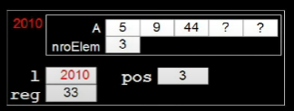

# Lista Linear

Estrutura de dados na qual cada elemento é precedido por um elemento e sucedido por outro

> exceto o primeiro que não tem predecessor e o último que não tem sucessor.

Os elementos estão em uma dada ordem (por exemplo, a ordem de inclusão ou ordenados por uma chave).

## Lista Linear Sequecial

é uma lista linear na qual a ordem lógica dos elementos (a ordem "Vista" pelo usuario) é a mesma ordem física (em memória principal) dos elementos.
isto é, elementos vizinhos na lista estarão em posições vizinhas de memória.

## Modelagem

Modelaremos usando um `arranjo` de registro;
`Registros` conterão as informações de interesse do usuário;
Nosso arranjo terá um `tamanho fixo` e controlaremos o número de elementos com uma `variável adicional`.

```c
#define MAX 50

typedef int TIPOCHAVE;

typedef struct {
    TIPOCHAVE chave;
    // outros campos
} REGISTRO;

typedef struct {
    Registro A[MAX];
    int nroElem;
} LISTA;
```

**Implementaremos funções para:**

- Inicializar a estrutura
- Retornar a quantidade de elementos válidos
- Exibir os elementos da estrutura
- Buscar um elemento na estrutura
- Inserir um elemento na estrutura
- Excluir um elemento da estrutura
- Reinicializar a estrutura

## Inicialização

para incializar uma estrutura qualquer, precisamos pensar nos valores adequadados para cada um dos campos de nossa estrutura.
Para inicializar uma lista sequencial já criada pelo usuário, só precisamos colocar o valor 0 (zero) no número de elementos válidos.

```c
void inicializarLista(LISTA l) {
    l.nroElem = 0;
}
```

Há algum problema com este código?
Qual a diferença entre os dois códigos abaixo?

```c
void inicializarLista(LISTA* l) {
    l->nroElem = 0;
}
```

A diferença é que no primeiro caso, estamos passando uma cópia da estrutura para a função, enquanto no segundo caso, estamos passando o endereço da estrutura.

## Retornar número de elementos

para retornar o número de elementos válidos, basta retornar o valor do campo `nroElem`.

```c
int tamanho(LISTA* l) {
    return l->nroElem;
}
```

## Exibir elementos

para exibir os elementos, basta percorrer o arranjo e exibir os `elementos` válidos.

```c
void exibirLista(LISTA* l) {
    int i;
    printf("Lista: \" ");
    for (i = 0; i < l->nroElem; i++) {
        printf("%i ", l->A[i].chave);
    }
    printf("\"\n");
}
```

## Buscar elemento

A função de busca deverá:

- Receber uma chave do usuário
- Retornar a posição em que este elemento se encontra na lista (caso seja encontrado)
- Retornar -1 caso o elemento não seja encontrado

```c
int buscaSequencial(LISTA* l, TIPOCHAVE ch) {
    int i = 0;
    while (i < l->nroElem) {
        if (l->A[i].chave == ch) return i;
        else i++;
    }
    return -1;
}
```

## Inserir elemento

O usuário passa como parâmetro o elemento a ser inserido na lista.
Há diferentes possibilidades de inserção:

- No início da lista
- No final da lista
- Ordenada pela chave
- Numa posição indicada pelo usuário

Vamos utilizar o último caso.

## Como inserir?

Se a lista não estiver cheia e o índice passado pelo usuário for válido, devemos: `desloca` todos os elementos posteriores uma posição para a direita;
`insere` o elemento na posição deseja, `soma um` no campo nroElem e retorna true
Caso contrário retorna false

```c
bool inserirElemLista(LISTA* l, REGISTRO reg, int i) {
    int j;
    if((l->nroElm == MAX) || (i < 0) || (i > l-> nroLem)) return false;
    for (j = l->nroElem; j > i; j--) l->A[j] = l->A[j-1]
    l->A[i] = reg;
    l->nroElem++;
    return true;
}
```

## Exclusão de um elemento

O usuário passa a chave do elemento que ele quer excluir

- Se houver um elemento com esta chave na lista, `"exclui este elemento"`,`descloca` todos os elementos posteriores uma posição para a esquerda, `subtrai um` do campo nroElem e retorna true
- Caso contrário retorna false

```c
bool excluirElemLista(LISTA* l, TIPOCHAVE ch) {
    int pos, j;
    pos = buscaSequencial(l, ch);
    if (pos == -1) return false;
    for (j = pos; j < l->nroElem-1; j++) l->A[j] = l->A[j+1];
    l->nroElem--;
    return true;
}
```

## Reinicialização da estrutura

Para esta estrutura, para reinicializar a lista basta colocar 0 (zero) no campo _nroElem_

```c
void reinicializarEstrutura(LISTA* l) {
    l->nroElem = 0;
}
```

## Otimização

Buscar produzir uma boa otimização no projeto para que possa ser mais eficiente

- `Otimização de busca` por elementos;
- Mudança na `ordem de inserção` dos elementos;

## Busca por elementos

O usuário diz qual elemento é buscado e a função retorna a posição desse elemento

- As chaves dos elementos **NÃO** estão em ordem crescente;
- Se o elemento não existir a função retornar -1;

Como é mostrado aqui 👇 **(versão inicial)**

```c
int buscaSequencial(LISTA* l, TIPOCHAVE ch) {
    int i = 0;
    while (i < l->nroElem) {
        if (l->A[i].chave == ch) return i;
        else i++;
    }
    return -1;
}
```

#### Ideia

Ao invés de fazer duas comparações por iteração, seria possivel fazer só uma?

- Precisamos sempre **comparar a chave do elemento atual** com a chave do elemento buscado;
- Mas como garatir que não iremos **passar do último elemento**
- Garantido que `a chave buscada será encontrada!`

##### Criação de um elemento sentinela

- **Elemento extra** (um registro) adicionado à lista para auxiliar alguma operação;
- Será **Inserido no final da lista** (após o último elemento valido) durante as bucas;
- Conterá a `chave do elemento buscado.`

```c
int buscaSentinela(LISTA* l, TIPOCHAVE ch) {
    int i = 0;
    l->A[l->nroElem].chave = ch;
    while(l->A[i].chave != ch) i++;
    if(i == l->nroElem) return -1;
    else return i;
}
```

Porém há um problema

- Se a lista já estiver **cheia**, não haverá espaço para conseguir colocar o **sentinela**;

O que fazer?

- Criar a lista com uma posição extra (**um registro a mais**) para garantir que haverá espaço para o sentinela
- Essa posição extra **nunca terá um registro valido**

> Obs: além disso a posição extra é uma posição que nunca será exibida, até por quê ela é colocada na ultima posição onde **nenhum** outro elemento da lista terá acesso.

##### Modelagem (Atualizada)

```c
#define MAX 50

typedef int TIPOCHAVE;

typedef struct {
    TIPOCHAVE chave;
    // outros campos
} REGISTRO;

typedef struct {
    REGISTRO A[MAX+1];
    int nroElem;
} LISTA;
```

Mas a **Busca binária** não seria mais eficiente?

- `Sim`, porém ela necessita que as chaves dos elementos estejam **ordenadas**;

Para isso, precisaremos mudar nossa função de **inserção de elementos**.

- A função de inserção de elementos seguirá a lógica do `insert sort`.

## Inserção ordenada (insert sort)

Agora é a parte que a filha chora, e a mãe não vê

- A função de inserção de elementos seguirá a lógica do `insert sort`.

```c
bool inserirElemListaOrd(LISTA* l, REGISTRO reg) {
    if(l->nroElem >= MAX) return false;
    int pos = l->nroElem;
    while(pos > 0 && l->A[pos-1].chave > reg.chave) {
        l->A[pos] = l->A[pos-1];
        pos--;
    }
    l->A[pos] = reg;
    l->nroElem++;
}
```

### Explicação do código

Temos uma lista passada como parâmetro e um registro que será inserido na lista.

e o usuario quer inserir o elemento `33`

a posição começa com um número de elementos da lista `A = [5, 9, 44]` e `nroElem = 3`

Então ele verifica o `pos > 0` e verifica se o elemento da posição anterior é maior que o elemento que ele quer inserir

> lembrando: que o valor do pos é a quantidade de elementos dentro da lista

Depois vê se da ultima posição da lista é maior que o elemento que ele quer inserir, caso seja ele vai deslocando os elementos para a direita, até que o elemento da posição anterior seja menor que o elemento que ele quer inserir

e depois ele insere o elemento na posição que ele parou

> A lista ficaria assim: `A = [5, 9, 33, 44]` e `nroElem = 4`



## Busca binária

- A busca binária é um algoritmo de busca em vetores que segue o paradigma de divisão e conquista.

- Ela parte do pressuposto de que o vetor está ordenado e realiza sucessivas divisões do espaço de busca comparando o elemento buscado (chave) com o elemento no meio do vetor.

```c
int buscaBinaria(LISTA* l, TIPOCHAVE ch) {
    int esq, dir, meio;
    esq = 0;
    dir = l->nroElem-1;

    while(esq<= dir) {
        meio = ((esq+dir)/2);
        if(l->A[meio].chave == ch) return meio;
        else {
            if(l->A[meio].chave < ch) esq = meio+1;
            else dir = meio-1;
        }
    }
    return -1;
}
```

## Elementos ordenandos pelas chaves

Com a ordenação dos elementos pela chave:

- A **busca** ficou **mais eficiente** (busca binária);
- Não precisamos do **sentila**;
- O que acontece com a `exclusão`?

## Exclusão de elementos

- A exclusão de elementos não é tão simples quanto a inserção;
- Precisamos **encontrar** o elemento a ser excluído;
- **Deslocar** todos os elementos posteriores uma posição para a esquerda;
- **Subtrair um** do campo nroElem e retornar true;

```c
bool excluirElemLista(LISTA* l, TIPOCHAVE ch) {
    int pos, j;
    pos = buscaBinaria(l, ch);
    if (pos == -1) return false;
    for (j = pos; j < l->nroElem-1; j++) l->A[j] = l->A[j+1];
    l->nroElem--;
    return true;
}
```